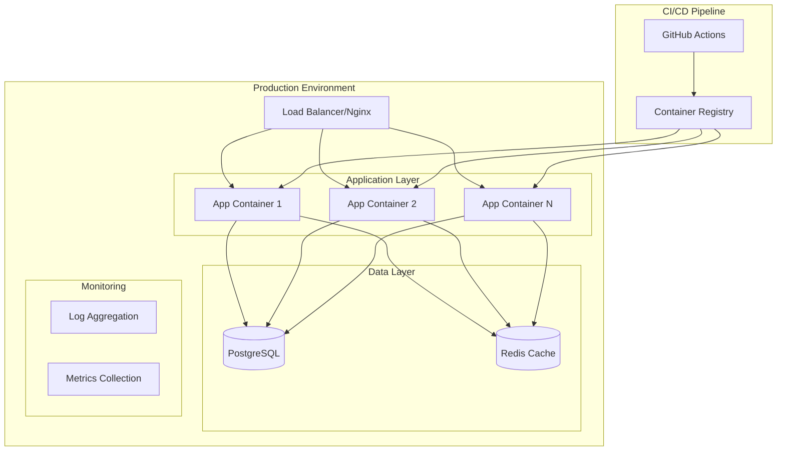

# Production Deployment Design Document

## Overview

This design outlines a comprehensive production deployment strategy for the AI Agent Chatbot system. The solution uses containerization with Docker, process management with Gunicorn/Uvicorn, database migrations with Alembic, CI/CD with GitHub Actions, and monitoring with structured logging. The architecture prioritizes security, scalability, and maintainability.

## Architecture

### Deployment Architecture



### Container Architecture

- **Multi-stage Docker build** for optimized production images
- **Non-root user** for security
- **Health checks** for container orchestration
- **Environment-specific configurations** via environment variables

## Components and Interfaces

### 1. Containerization Components

#### Dockerfile
- Multi-stage build with separate stages for dependencies and runtime
- Python slim base image for reduced attack surface
- Non-root user execution
- Health check endpoint integration

#### Docker Compose
- Development and production configurations
- Service orchestration (app, database, redis)
- Volume management for persistent data
- Network isolation and security

### 2. Application Server Components

#### ASGI Server (Uvicorn/Gunicorn)
- Production-grade ASGI server for async Python applications
- Worker process management
- Graceful shutdown handling
- Performance optimization settings

#### Web Framework Wrapper
- FastAPI wrapper around the existing agent
- REST API endpoints for agent interaction
- Health check and metrics endpoints
- Request/response validation

### 3. Database Components

#### Migration System (Alembic)
- Database schema version control
- Automated migration scripts
- Rollback capabilities
- Environment-specific configurations

#### Connection Management
- Connection pooling with SQLAlchemy
- Connection retry logic
- Database health monitoring

### 4. Configuration Management

#### Environment Configuration
- Separate configs for dev/staging/production
- Secret management integration
- Configuration validation
- Runtime configuration updates

#### Secret Management
- Environment variable injection
- Docker secrets integration
- Kubernetes secrets support (future)

### 5. Monitoring and Observability

#### Structured Logging
- JSON-formatted logs
- Correlation IDs for request tracing
- Log level management
- Centralized log aggregation

#### Health Checks
- Application health endpoint
- Database connectivity checks
- External service dependency checks
- Kubernetes readiness/liveness probes

#### Metrics Collection
- Application performance metrics
- Database connection metrics
- Custom business metrics
- Prometheus-compatible format

### 6. CI/CD Pipeline

#### GitHub Actions Workflow
- Automated testing on pull requests
- Container image building and scanning
- Multi-environment deployment
- Rollback capabilities

#### Deployment Stages
- Development: Automatic deployment on merge
- Staging: Automatic deployment with smoke tests
- Production: Manual approval with blue-green deployment

## Data Models

### Configuration Schema
```python
class DeploymentConfig:
    environment: str  # dev, staging, production
    database_url: str
    redis_url: str
    log_level: str
    worker_count: int
    max_connections: int
    health_check_interval: int
```

### Health Check Response
```python
class HealthCheckResponse:
    status: str  # healthy, unhealthy, degraded
    timestamp: datetime
    services: Dict[str, ServiceHealth]
    version: str
```

## Error Handling

### Application Level
- Graceful degradation when external services are unavailable
- Circuit breaker pattern for external API calls
- Retry logic with exponential backoff
- Comprehensive error logging with context

### Infrastructure Level
- Container restart policies
- Database connection retry logic
- Load balancer health check integration
- Automated failover mechanisms

### Monitoring and Alerting
- Real-time error rate monitoring
- Threshold-based alerting
- Escalation procedures
- Incident response automation

## Testing Strategy

### Unit Testing
- Existing test suite integration
- Configuration validation tests
- Health check endpoint tests
- Database migration tests

### Integration Testing
- Container integration tests
- Database connectivity tests
- External service integration tests
- End-to-end API tests

### Deployment Testing
- Smoke tests after deployment
- Performance regression tests
- Security vulnerability scanning
- Infrastructure validation tests

### Production Testing
- Canary deployments
- Blue-green deployment validation
- Rollback procedure testing
- Disaster recovery testing

## Security Considerations

### Container Security
- Non-root user execution
- Minimal base images
- Regular security updates
- Vulnerability scanning

### Network Security
- Service mesh integration (future)
- Network policies and isolation
- TLS encryption for all communications
- API rate limiting and authentication

### Secret Management
- No secrets in container images
- Environment variable injection
- Rotation procedures
- Audit logging for secret access

## Performance Optimization

### Application Performance
- Connection pooling
- Async request handling
- Caching strategies
- Resource optimization

### Infrastructure Performance
- Horizontal scaling capabilities
- Load balancing strategies
- Database query optimization
- CDN integration for static assets

## Deployment Strategy

### Blue-Green Deployment
- Zero-downtime deployments
- Quick rollback capabilities
- Traffic switching mechanisms
- Database migration coordination

### Scaling Strategy
- Horizontal pod autoscaling
- Database connection management
- Resource limit configuration
- Performance monitoring integration